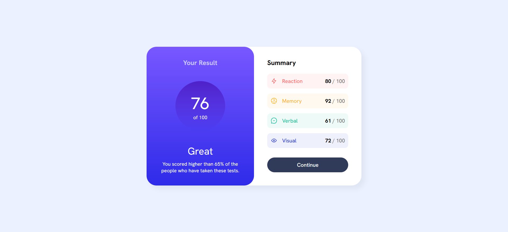

# Frontend Mentor - Results summary component solution

This is a solution to the [Results summary component challenge on Frontend Mentor](https://www.frontendmentor.io/challenges/results-summary-component-CE_K6s0maV). Frontend Mentor challenges help you improve your coding skills by building realistic projects. 

## Table of contents

- [Overview](#overview)
  - [The challenge](#the-challenge)
  - [Screenshot](#screenshot)
  - [Links](#links)
- [My process](#my-process)
  - [Built with](#built-with)
  - [What I learned](#what-i-learned)
  - [Continued development](#continued-development)
- [Author](#author)

**Note: Delete this note and update the table of contents based on what sections you keep.**

## Overview

### The challenge

Users should be able to:

- View the optimal layout for the interface depending on their device's screen size
- See hover and focus states for all interactive elements on the page
- **Bonus**: Use the local JSON data to dynamically populate the content

- Also, my personal challenge here is to practice with the basics of **React**.

### Screenshot

### Links

- Solution URL: https://github.com/guillemfrasquet/results-summary-component
- Live Site URL: https://guillemfrasquet.github.io/results-summary-component/

## My process

### Built with

- Semantic HTML5 markup
- CSS custom properties
- Flexbox
- [React](https://reactjs.org/) - JS library

### What I learned

I have practiced with React components and basics about the structure of this Framework. 

### Continued development

The aim of this solution is to start a series of challenges to improve my React knowledge. So, if there is something to especially focus on in this project, it is the React coding.

## Author

- Frontend Mentor - [@guillemfrasquet](https://www.frontendmentor.io/profile/guillemfrasquet)
